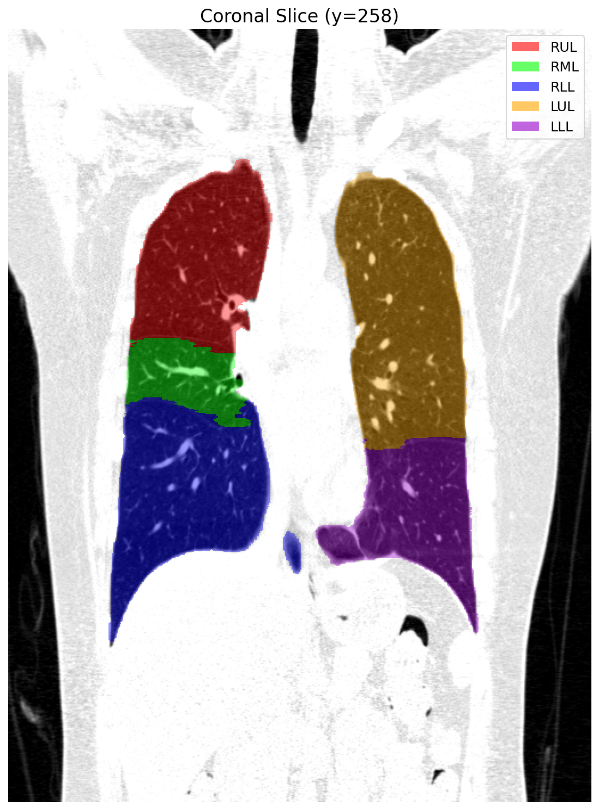

# Airway Generation Source Code

Source code for generating complete lung airway trees from patient-specific imaging data, based on the algorithm described in Tawhai et al. 2004 (J Appl Physiol). These files are copies of the [Chaste](https://chaste.cs.ox.ac.uk/) lung module (`lung/src/airway_generation/`), kept here for reference. The actual code used at build time comes from Chaste itself.

## Prerequisites: Install Chaste

This project depends on the **Chaste** framework (lung module). You must install and build Chaste **before** using this code. The C++ source files (`AirwayGenerator`, `MultiLobeAirwayGenerator`, etc.) are already included in Chaste's `lung/src/airway_generation/` module — you do not need to compile them separately.

### Step 1: Install and Build Chaste

Follow the official Chaste installation guide: https://chaste.github.io/docs/installguides/

Make sure to build with the **lung** component enabled.

### Step 2: Create the Project Inside Chaste

Chaste does not generate this for you — you must manually create the following directory structure under your Chaste source tree:

```
Chaste/
└── projects/
    └── MyAirwayProject/
        ├── CMakeLists.txt          # you create this
        ├── src/
        │   └── empty.cpp           # you create this (empty file)
        ├── data/                   # (optional, for single-sample testing)
        └── test/
            ├── CMakeLists.txt      # you create this
            └── (test .hpp files)   # auto-generated by batch.py
```

Create these 3 files manually:

**`Chaste/projects/MyAirwayProject/CMakeLists.txt`:**

```cmake
find_package(Chaste COMPONENTS lung)
chaste_do_project(MyAirwayProject)
```

**`Chaste/projects/MyAirwayProject/test/CMakeLists.txt`:**

```cmake
project(testMyAirwayProject)
find_package(Chaste COMPONENTS lung)
chaste_do_test_project(MyAirwayProject)
```

**`Chaste/projects/MyAirwayProject/src/empty.cpp`:** Create an empty file (required by Chaste's build system).

The test `.hpp` files (e.g., `TestAtm0010000AirwayGeneration.hpp`) do **not** need to be created manually — `batch.py` auto-generates one for each sample in Step 4.

### Step 3: Configure `batch.py`

Edit the paths at the top of `batch.py` to match your environment:

```python
CHASTE_SOURCE = "/path/to/Chaste"          # Chaste source directory (contains projects/)
CHASTE_BUILD  = "/path/to/Chaste_build"    # Chaste build directory
PROJECT_NAME  = "MyAirwayProject"
DATA_DIR      = "/path/to/Airway_Growing/data/generations"  # where VTU + STL files are
OUTPUT_BASE   = "/path/to/Airway_Growing/output"
```

`batch.py` will automatically:
1. Discover all samples in `DATA_DIR` (by finding `*_major_airways.vtu` files)
2. Generate a C++ test `.hpp` file for each sample into `Chaste/projects/MyAirwayProject/test/`
3. Run `cmake`, `make`, and `ctest` to build and execute each test

### Step 4: Build and Run

```bash
python batch.py
```

This runs cmake with `-DChaste_ENABLE_project_MyAirwayProject=ON`, builds each test target, and executes them via ctest. Output is written to `OUTPUT_BASE/{NAME}_airway_generation/`.

## Input Data

### Download

All required input data is available at:

**https://drive.google.com/drive/folders/1urZeE1AExQ0WWJOvRTTMmKsBSbvqDCS7?usp=sharing**

### Data Path

Set `DATA_DIR` in `batch.py` to point to the directory containing the downloaded data files (the VTU and STL files described below). For example:

```python
DATA_DIR = "/path/to/Airway_Growing/data/generations"
```

### Required Files Per Sample

For each patient sample `{NAME}`, the following 6 files are required:

| File | Description |
| ---- | ----------- |
| `{NAME}_major_airways.vtu` | **Major airways skeleton** — a VTK XML Unstructured Grid file representing the proximal airway tree extracted from CT imaging. Contains 3D node coordinates (in meters), line-segment connectivity, and per-node data arrays: `radius` (branch radius at each node) and `start_id` (terminal marker: 1 = terminal endpoint where lobe growing begins, 0 = intermediate node). This is the starting tree that gets extended into the distal airways. |
| `{NAME}_lll.stl` | **Left Lower Lobe** surface mesh — a closed 3D surface (STL format) defining the boundary of the left lower lobe, segmented from CT. Used to confine airway branch growing within this lobe's volume. |
| `{NAME}_lul.stl` | **Left Upper Lobe** surface mesh — boundary of the left upper lobe. |
| `{NAME}_rll.stl` | **Right Lower Lobe** surface mesh — boundary of the right lower lobe. |
| `{NAME}_rml.stl` | **Right Middle Lobe** surface mesh — boundary of the right middle lobe. |
| `{NAME}_rul.stl` | **Right Upper Lobe** surface mesh — boundary of the right upper lobe. |

The 5 lobe STL files together cover the entire lung volume. The airway generator uses them to determine which lobe each terminal airway belongs to and to constrain branch growth within the correct anatomical region.



## Files

### Core Classes

| File | Description |
| ---- | ----------- |
| `AirwayGeneration.hpp/cpp` | Defines the `Apex` (growth apex) and `AirwayGeneration` (a collection of apices for one generation level) data structures used during tree growing |
| `AirwayGenerator.hpp/cpp` | Single-lobe airway growing algorithm. Fills a lobe volume with seed points, then iteratively grows branches via bifurcation from initial apices toward point cloud centers |
| `MultiLobeAirwayGenerator.hpp/cpp` | Wraps `AirwayGenerator` to handle all 5 lung lobes (RUL, RML, RLL, LUL, LLL) together. Assigns growth apices from major airways to the correct lobes, distributes seed points proportionally by lobe volume, generates each lobe's tree, and merges the results into a single output |
| `AirwayRemesher.hpp/cpp` | Rebalances airway tree meshes to improve condition number for downstream flow simulations |

### Batch Runner

| File | Description |
| ---- | ----------- |
| `batch.py` | Python script that auto-discovers patient samples, generates Chaste C++ test files for each, then builds and runs them via cmake/make/ctest |

## Dependencies

- **Chaste** framework (lung module) — see [Prerequisites](#prerequisites-install-chaste)
- **VTK** >= 5.6 (for mesh I/O, STL reading, point cloud operations)
- **PETSc** (Chaste runtime dependency)

## Algorithm Overview

1. Load patient-specific major airways mesh (`.vtu`) with radius and terminal marker data
2. Load 5 lung lobe surfaces (`.stl`) — right upper/middle/lower, left upper/lower
3. Assign terminal nodes of the major airways as growth apices in the corresponding lobes
4. Generate seed point clouds within each lobe, distributed proportionally by volume
5. Grow airway branches iteratively: each apex bifurcates toward the center of its local point cloud, splitting the cloud and creating child apices
6. Compute Horsfield ordering and branch radii
7. Merge all lobe trees with the major airways and output as `.vtu`, Triangle/TetGen, and CMGUI formats
